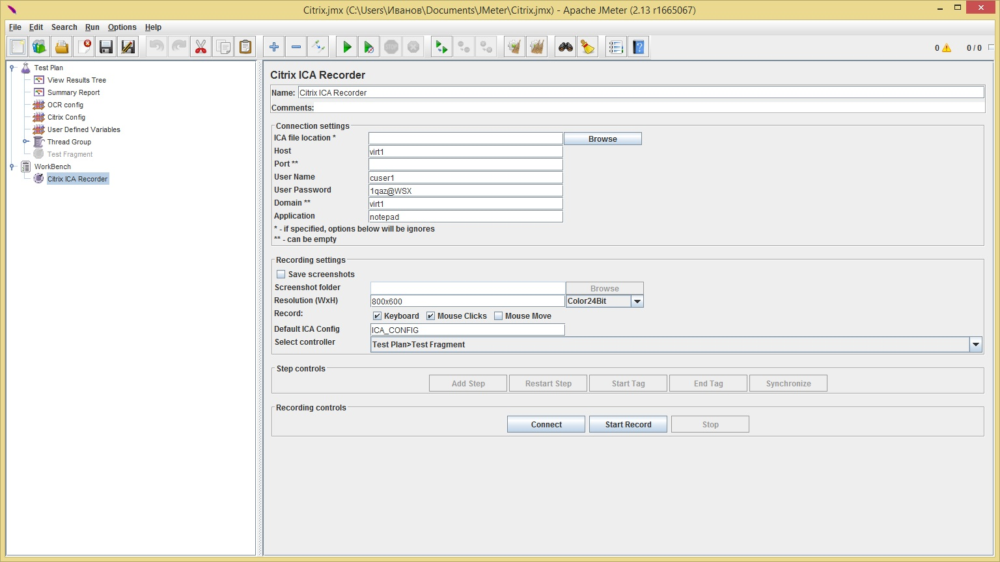
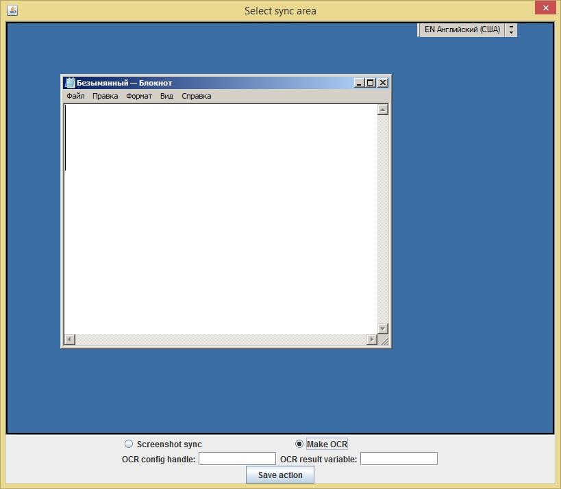
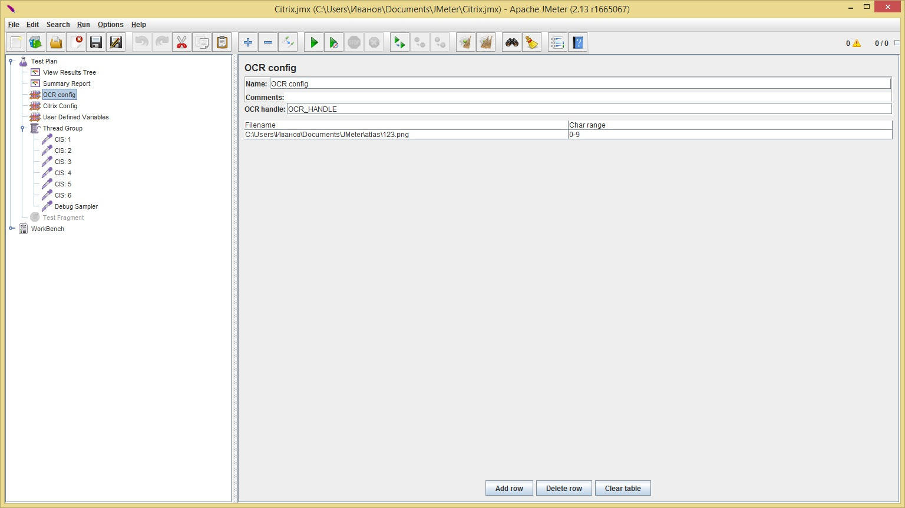
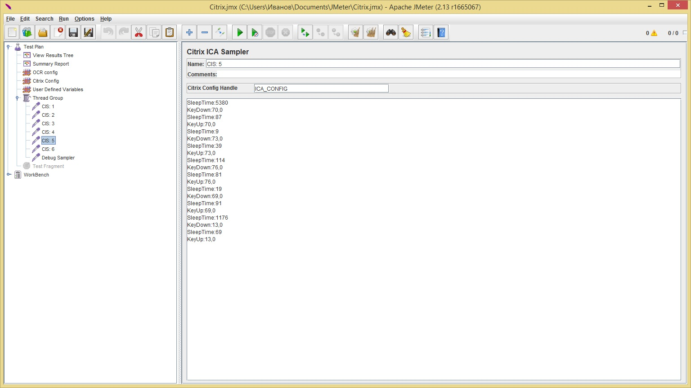

# Jmeter Citrix Plugin
Плагин позволяет взаимодействовать с протоколом Citrix посредством клиента Citrix Receiver.

Скачать можно [здесь](https://github.com/pflb/Jmeter-Citrix-Plugin/releases/download/v1.0/CitrixICA.zip).

## Введение

Использование HP LoadRunner для записи и воспроизведения скриптов на Citrix не всегда подходит для заказчиков ввиду большой стоимости первого. Поэтому было решено попробовать подружить с Citrix`ом JMeter. В этой статье речь пойдет об установке и использовании данного плагина.

## Возможнсти

- Запись действий пользователя (ввод с клавиатуры, нажатие и передвижение мыши) с выбором нужных источников ввода.
- Воспроизведение записанного скрипта.
- Запуск сессии посредством .ica файлов.
- Запуск сессий с выбранными параметрами (размер области Citrix, глубина цветопередачи).
- Возможность (не)сохранять сделанные скриншоты во время записи/воспроизведения.
- Возможность параметризовать любую команду/параметр в семплерах.
- Возможность указать множитель всех thinktime`ов.
- Возможность запускать сессии без блокировки ввода пользователя.
- Широкие настройки синхронизации.
- Возможность указать (в теории) бесконечное количество хеш-сумм для синхронизации.
- Интегрирован OCR (Optical Character Recognition) движок для распознавания текста.
- Настройка, позволяющая (не)запускать новую сессию при каждой итерации.
- Поддержка Remote Start.
- Бесплатность, открытый исходный код.

## Ограничения

- Работает только с JRE x86. При использовании 64-х битной версии, не находит COM класс.
- На данный момент невозможно запускать сессии в Windowless режиме (без отображения окна).
- В некоторых случаях игнорируется параметр цветопередачи.

## Установка плагина

### Что нам нужно для работы

Для корректной работы плагина нужно следующее:

- **JMeter** для работы плагина;
- **Библиотека com4j** для работы с COM (нужно для плагина, скачать можно здесь);
- **JRE x86** версии 7 и выше для корректной работы COM4J и плагина (можно скомпилировать и под JRE 6-й версии);
- **Citrix Receiver**, через который будет происходить запись и воспроизведение.

### Установка плагина

Не стану описывать, как устанавливать JMeter и JRE, думаю, всем это уже знакомо. Установка Citrix Receiver тоже не вызывает трудностей, поэтому перейдем сразу к установке плагина. Для установки самого плагина достаточно скопировать .jar файлы com4j библиотеки в папку lib в корне JMeter, а сам плагин в lib/ext. Но для возможности записи/воспроизведения нужно так-же добавить запись в реестре (путь приведен для Windows x64, для 32-х разрядных изданий из пути нужно убрать подкаталог Wow6432Node):

	Windows Registry Editor Version 5.00
	
	[HKEY_LOCAL_MACHINE\SOFTWARE\Wow6432Node\Citrix\ICA Client\CCM]
	"AllowSimulationAPI"=dword:00000001

Этот текст можно сохранить в текстовый файл с расширением .reg и добавить запись в реестр, запустив этот файл.

## Запись скрипта

### Подготовка к записи

Для записи скриптов нужно добавить в WorkBench элемент Citrix ICA Recorder (находится в категории Non-Test Elements) и указать там правильные параметры подключения:

- **ICA file location** - путь к файлу .ica для инициализации сессии. Если указан, остальные параметры подключения будут игнорироваться. Можно выбрать через GUI, нажав кнопку Browse;
- **Host** - адрес сервера;
- **Port** - порт для подключения. Если не указан, используется стандартный;
- **User Name** - имя пользователя, которому разрешен доступ к опубликованному приложению;
- **User Password** - пароль пользователя;
- **Domain** - домен пользователя, может быть пустым;
- **Application** - имя опубликованного приложения;

Так же следует настроить параметры записи:

- **Save screenshots** - если включено, скриншоты, полученные во время записи, будут сохранены;
- **Screenshot folder** - путь к папке, в которой будут сохраняться скриншоты. Кнопка Browse позволяет выбрать путь через GUI;
- **Resolution (WxH)** - указывает размер рабочей области Citrix приложения (максимальный размер окна). Указывается в формате <ШИРИНА>x<ВЫСОТА>, разделитель - латинская x;
- **Color 24 bit** - указывает, какую глубину цветопередачи использовать;
- **Record:** - указывает, какие события записывать, а какие нет. Возможные варианты: Keyboard - записывать события клавиатуры, Mouse Clicks - записывать нажатия кнопок мыши, Mouse Move - записывать события перемещения курсора мыши;
- **Default ICA Config** - указывает, какой ICA Config Element использовать в записанных семплерах по умолчанию (об этом будет подробно расписано далее);
- **Select controller** - указывает, в какой контроллер помещать записанные семплеры;

### Запись сессии

После того, как все настройки были введены, можно подключиться к сессии и начать запись.
Для включения/выключения записи в рекордере есть группа кнопок **Recording controls**.
Кнопка **Connect** просто выполняет подключение к сессии.
При этом запись не начинается и ее можно включить позже.
Кнопка **Record** подключается и сразу же начинает записывать выбранные действия.
Кнопка **Stop** позволяет остановить запись и отключиться от сессии.
При этом сама сессия (окно Citrix Receiver) не закрывается.
Так же, при выходе из сессии (например, при закрытии приложения) по событию LogOut происходит автоматическая остановка записи.

Для управления шагами присутствует группа кнопок **Step controls**. Она становится доступной после включения режима записи.
Кнопка **Add Step** сохраняет текущий шаг и добавляет его в выбранный контроллер. При этом запись начинает происходить в новый семплер.
Кнопка **Restart Step** просто очищает текущий шаг от всех действий (полезно в случае ошибки).
Кнопка **Start Tag** ставит метку, что все команды, записанные до нажатия кнопки **End Tag**, будут проигнорированы и вместо них будет вставлен текст, введенный пользователем.
Кнопка **End Tag**, соответственно, ставит метку окончания действия команды **Start Tag**.
Кнопка **Synchronize** делает скриншот всей области Citrix сессии и вызывает диалог настройки синхронизации, на чем я хочу остановиться более подробно.

## Синхронизация

На данный момент реализовано 2 варианта синхронизации: по скриншоту и по тексту (путем использования OCR).

#### Синхронизация по скриншотам

Для синхронизации по скриншотам, нужно выбрать область синхронизации (красный полупрозрачный прямоугольник) и выставить правильные параметры.
- **Wait sync** - указывает, нужно ли ждать момента, когда будет найдена область с указанным хешом и сколько по времени (максимум) ждать. Второй параметр, **try every**, указывает, как часто делать проверку. Параметры задаются целыми числами в миллисекундах.
- **Delta x, y** - указывает, на каком максимальном удалении по ширине и высоте соответственно искать нужную область. Полезно в случаях, если элемент, по которому проводится синхронизация, может незначительно сдвинуться. Но, совершенно бесполезная вещь, если элемент меняет свой размер, т.к. хеш-сумма скриншота будет другой.
- **Set sampler error if failed** - указывает, помечать ли семплер провалившимся в случае, если за указанное время не удалось найти указанную область. Если не стоит, семплер будет считаться всегда успешным и единственное, как можно будет отличить, появилась ли область или нет, проверять значение переменной, указанной в следующем пункте.
- **Write result in variable named** - указывает имя переменной, в которую записать успешность синхронизации. На выходе в переменной будет true, если область найдена, иначе false.
Такой вид синхронизации происходит путем сравнения хеш-сумм скриншотов  указанных областей при записи и при воспроизведении. Соответственно, изменение цвета одного пикселя при воспроизведении изменит хеш-сумму скриншота до неузнаваемости, что приведет к ошибке сравнения и область будет считаться не найденной.

#### Синхронизация по тексту

Для синхронизации по тексту, нужно так же выбрать область экрана, в которой будет распознан текст.
Так же необходимо указать два параметра: **OCR config handle** - строка, указанная в тест-элементе **OCR Config** в поле **OCR Handle ** (об этом далее), по которой происходит выбор настроенного OCR движка, который будет использоваться для распознавания, и **OCR result variable** - имя переменной, в которую будет записан результат.
В случае, если распознать ничего не удалось, переменная будет создана и инициализирована пустой строкой.

## Подготовка к воспроизведению

После записи скрипта, у вас должен получиться тест-план с контроллером и Citrix ICA Sampler`ами внутри.
Для воспроизведения сессии необходим как минимум один **Citrix ICA Config** элемент.

### Конфигурация воспроизведения

**Citrix ICA config** выглядит очень похожим на **Citrix ICA Recorder**.
У него точно такие же параметры подключения, поэтому описывать их здесь нет смысла, стоит только упомянуть, что все поля в конфигурации подключения могут быть параметризованы, а эти значения будут использованы при инициализации сессии, то есть при выполнении первого попавшегося **Citrix ICA Sampler**.
Например, можно смело использовать **CSV Data Set Config** для параметризации полей.
Поле **Citrix Config Handle** должно быть уникальным для всех таких конфигов.
По нему семплеры определяют, какие настройки подключения использовать и подцепляют сессию для продолжения теста.

Настройки воспроизведения сессий отличаются от таковых в рекордере. Остановлюсь на несовпадениях:
- **New session each iteration** - если указано, при каждой итерации будет создаваться новая сессия. Старая же, если она не закрыта, останется активной, но будет бездействовать.
- **Replay mode** - если указано, то весь ввод в запущенные сессии будет запрещен. Иначе, пользователь сможет использовать мышь/клавиатуру для ввода данных в открытое приложение. Нужно скорее для отладки.
- **Output mode** - режим отображения окна. Если указано Normal, окно будет выводиться на экран. Если указано Windowless - окно не будет отображаться, тем самым экономя ресурсы нагрузочных станций (в текущей версии не удалось добиться результата, Receiver игнорирует данную настройку).
- **Use sleep times** - если указано, все записанные/введенные в ручную задержки будут воспроизводиться. Так же можно указать множитель, на который будут умножаться времена ожидания (только для команд **SleepTime**).
- **Unlock all sessions** и **Lock all sessions** - разблокирует и блокирует ввод во всех активных сессиях, т.е. меняет параметр **Replay mode** на "лету". Работает только с теми сессиями, которые запущены на активном JMeter`е и не работает при запуске на удаленных серверах.

### Конфигурация OCR

Если при записи были записаны действия распознавания текста, то так же необходимо добавить элемент **OCR Config**.
Он достаточно прост и имеет всего два параметра:
- **OCR handle** - параметр, отличающийся от **Citrix ICA Handle** лишь тем, что идентифицирует не Citrix ICA Config, а OCR Config. Должен быть уникальным для всех OCR Config.
- **Таблица** - в левой колонке указывается путь к изображению, с помощью которого происходит обучение, в правой - диапазон символом в изображении (задается в формате <Начальный символ>-<Конечный символ> без угловых скобок и с разделителем в виде тире).
Обучающие изображения - изображение, на котором по порядку отпечатаны символы (можно стройкой, можно таблицей).
Обязательное условие - диапазон кодов указанных символов должен быть непрерывен и направлен в сторону увеличения.
На каждом изображении должен быть указан лишь один диапазон.

### Описание семплеров

Кроме стандартных названия и комментария, Citrix ICA Sampler содержит два поля.
Первое - **Citrix Config Handle** - указывает, какие настройки использовать для запуска сессии или из какого пула взять уже активную сессию.
Второе поле содержит список всех команд, которые он будет выполнять.
Это поле может быть полность параметризовано с помощью переменных JMeter`а.

### Описание команд

Каждая команда состоит из названия команды и параметров, каждая команда начинается с новой строки.
Если в начале строки стоит знак решетки (**#**), то строка считается комментарием и выполняться не будет.
Пустой семплер запустит сессию (если она не была инициирована) и больше ничего не сделает.
После команды должно стоять двоеточие и перечислен список параметров через запятую.
У всех команд, кроме синхронизации по скриншотам, фиксированное количество параметров.
Теперь подробнее о командах.
- **SleepTime** - команда, которая осуществляет задержку. Единственный ее параметр - время в миллисекундах, в течении которого поток будет простаивать. Задается целым числом.
- **KeyDown** и **KeyUp** - нажимает и отпускает, соответственно, клавишу на клавиатуре. Принимает 2 параметра: первый - код клавиши, которая будет нажата/отпущена. Второй - модификатор (Alt, Control, etc.), который на данный момент не используется. Но без него команда выбросит exception.
- **MouseDown** и **MouseUp** - нажимает и отпускает, соответственно, кнопку мыши. Принимает 4 параметра: код кнопки мыши, модификатор нажатия, X-координату на экране и Y-координату на экране. Второй параметр, в отличии от KeyDown и KeyUp, передается ресиверу, но на данный момент неизвестно, влияет ли он на что-то (да и не так много приложений, обрабатывающих подобные щелчки мышкой).
- **MouseDClick** - команда, оставшаяся с этапа разработки. В дальнейшем она будет игнорироваться. Не выполняет ничего. Параметры идентичны KeyUp и KeyDown.
- **MouseMove** - двигает курсор мыши по экрану. Параметры идентичны MouseDown и MouseUp.
- **StartTag** - указывает, что все команды до команды **EndTag** будут игнорироваться, а вместо них введен текст из параметров. Принимает 2 параметра: первый - время между вводом символов в миллисекундах, второй - текст, который нужно ввести. Поддерживается лишь однострочный текст.
- **EndTag** - указывает окончание действия команды **StartTag**. Принимает один параметр. Значение параметра не имеет значения, по умолчанию - null.
- **Screenshot** - выполнить синхронизацию. Принимает на вход список хеш-сумм области и параметры. Сначала идет список хеш-сумм, разделенных запятой. Представляют собой строки. Далее - список параметров. Первый - координата X, второй - координата Y левого верхнего угла области, по которой  будет происходить синхронизация. Третий параметр - ширина, четвертый - высота области. Пятый и шестой параметры - сдвиг по оси X и по оси Y в оба направления - количество пикселей, в пределах которых будет выполняться поиск нужной области, если область не нашлась по центру. Может помочь в случае, когда элементы на экране могут сдвигаться. 1-6 параметр - целые числа. Седьмой параметр указывает, необходимо ли ждать появления этой области или только выполнить проверку на ее наличие. Представляет собой булево значение (true/false). Восьмой параметр - время ожидания области, девятый - интервал проверок. Задаются в миллисекундах. Игнорируются, если седьмой параметр false. Представляют собой целые числа. Десятый параметр - ставить ли семплеру статус ошибки в случае, если область не найдена. Может быть true или false. Последний параметр - имя переменной, в которую будет занесен результат синхронизации: true, если область найдена или false, если не найдена.
- **OCR** - команда распознавания текста в области. Первые четыре параметра - координаты и размеры области, эквиваленты таковым в команде Screenshot. Пятый параметр - строка, характеризующая, какой OCR config использовать для распознавания. Шестой параметр - имя переменной, в которую будет занесен результат.

## Воспроизведение скрипта

Для воспроизведения записанного и параметризованного скрипта достаточно просто запустить тест.
После прохождения каждого семплера в Response Data можно будет посмотреть успешность выполнения каждой команды.

### Советы 

Если для инициализации сессий используются .ica файлы - лучше параметризовать поле, отвечающее за него.
Так как этот файл является одноразовым, второй поток (итерация) не сможет запуститься с тем же файлом.
Для решения этой проблемы можно получать эти файлы непосредственно перед стартом сессии используя, например, веб протокол.

В случае, если семплеру не удалось получить управление сессией в течении 120 секунд, будет выполнена попытка сделать logout и disconnect сессии в течении еще 60 секунд, после чего автоматически будет предпринята повторная попытка подключения.

Если в редких случаях при синхронизации по скриншотам возникает ошибка - не огорчайтесь, попробуйте добавить хеш-сумму, полученную при воспроизведении, к семплеру (хеш-сумму можно просмотреть на вкладке Response Data в View Results Tree, если при синхронизации произошла ошибка).

В случае, если предполагается одно из нескольких действий в зависимости от того, что выведено на экран, можно использовать синхронизацию без времени ожидания и условные контроллеры в цикле для выполнения нужного действия.

При использовании клиента Citrix Receiver версии 4.4 и выше, невозможно запустить сессию с "прямыми" параметрами подключения. Только через файлы .ica.
